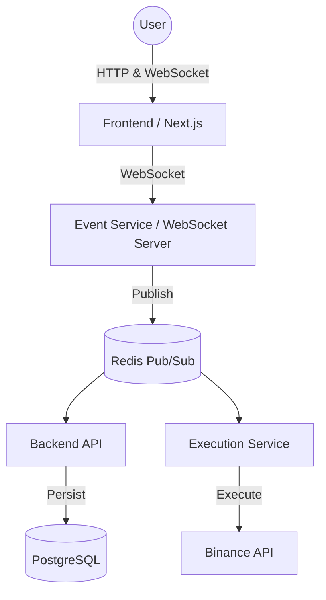

# TradeCO  
**A Full-Stack, Event-Driven Trading Platform**

TradeCO is a production-inspired trading platform built to demonstrate advanced system design, backend architecture, real-time event processing, and frontend engineering.

Instead of a CRUD-style application, TradeCO models how modern trading systems are actually structured: decoupled services, asynchronous workflows, streaming data, and failure-isolated components.

This project was built as an engineering assignment to showcase architecture, not just features.

---

## Live Demo

- **Application:** https://tradeco.devpushkar.com  
- **Video Walkthrough:** https://youtu.be/zWeUJQZotOI

---

## Problem Statement

The goal was to design and implement a system capable of handling real trading-like complexity:

- Secure authentication and user state
- Asynchronous order execution
- Real-time market data and order updates
- High-performance charting
- Scalability beyond a monolith

---

## System Overview

Numatix is structured as a **monorepo** containing multiple decoupled services:

- **Frontend:** Next.js (App Router)
- **Backend API:** Node.js + PostgreSQL
- **Event Service:** Redis Pub/Sub + WebSockets
- **Execution Service:** Node.js + Binance API

Each service has a clearly defined responsibility and communicates through events rather than tight coupling.

---

## Architectural Philosophy

- **Event-Driven Design**  
  Services react to events instead of synchronous request chains.

- **Separation of Concerns**  
  Execution, persistence, and real-time delivery are isolated.

- **Stateless Services**  
  Horizontal scalability is supported by design.

- **Failure Isolation**  
  External API failures do not cascade into user-facing downtime.

---

## High-Level Architecture

⸻

Service Breakdown

1. Frontend

Path: apps/frontend
Stack: Next.js (App Router), TailwindCSS, Lightweight Charts, Zod

Responsibilities:
	•	UI rendering and authentication flow
	•	Real-time candlestick charting
	•	Subscribing to live market and order streams
	•	Merging historical snapshots with streaming updates

Key Detail:
The frontend receives ORDER_UPDATE and KLINE_UPDATE events via WebSockets. No polling is used.

⸻

2. Backend API

Path: apps/backend
Stack: Node.js, Prisma, PostgreSQL, Redis

Responsibilities:
	•	Authentication and authorization
	•	Persistence layer (source of truth)
	•	Order and position state management

Design Decision:
This service never executes trades. It validates requests, stores state, and acts as a secure gateway.

⸻

3. Event Service

Path: apps/event-service
Stack: Node.js, Redis, WebSocket Server

Responsibilities:
	•	Central real-time communication hub
	•	Subscribes to Redis channels
	•	Broadcasts events to connected frontend clients

⸻

4. Execution Service

Path: apps/execution-service
Stack: Node.js, Binance API

Responsibilities:
	•	External exchange integration
	•	Trade execution logic

Execution Flow:
	1.	Consumes ORDER_COMMAND
	2.	Executes trade on Binance
	3.	Publishes ORDER_EVENT back to Redis

⸻

Data Flow Walkthroughs

Authentication Flow
	1.	User logs in from the frontend
	2.	Backend validates credentials
	3.	JWT/session token is issued
	4.	Token is attached to HTTP and WebSocket connections

⸻

Order Lifecycle (Asynchronous)
	1.	User places an order from the UI
	2.	Frontend sends payload to the Event Service
	3.	Event Service publishes ORDER_COMMAND to Redis
	4.	Execution Service consumes and executes on Binance
	5.	Binance confirms execution
	6.	Execution Service publishes ORDER_EVENT
	7.	Backend persists the result in PostgreSQL
	8.	Event Service pushes updates to the user interface in real time

⸻

Deployment & Infrastructure
	•	Frontend: Vercel (Production)
	•	Backend API & Services: Ubuntu VPS with PM2
	•	Database: Managed Cloud PostgreSQL
	•	Event Bus: Managed Redis Cloud
	•	External Exchange: Binance API

⸻

Database Design

ORM: Prisma
Database: PostgreSQL

Table	Description
User	Authentication and profile data
OrderCommand	Intent to buy or sell
OrderEvent	Execution result (Filled, Rejected, etc.)
Position	Aggregated holdings per trading symbol

⸻

Engineering Notes

Temporary Backend Patch

Account balance updates are designed to be streamed via Redis events.

Due to time constraints and an unresolved synchronization issue in the event propagation layer, the exact root cause could not be identified during the assignment window. To ensure correctness for the live demo, a temporary backend-side patch was applied to stabilize balance updates.

This workaround does not change the core event-driven architecture and is intended to be revisited.

⸻

Key Engineering Decisions
	•	Redis over HTTP for Inter-Service Communication
Enables loose coupling and independent service failure.
	•	Isolated Execution Layer
External exchange instability cannot impact core services.
	•	Trade-offs & Limitations
	•	Simplified risk engine
	•	JWT-based authentication
	•	No automated exchange failover

⸻

Author

Pushkar Dev
Full-Stack Engineer
	•	Portfolio: https://devpushkar.com
	•	Live App: https://tradeco.devpushkar.com